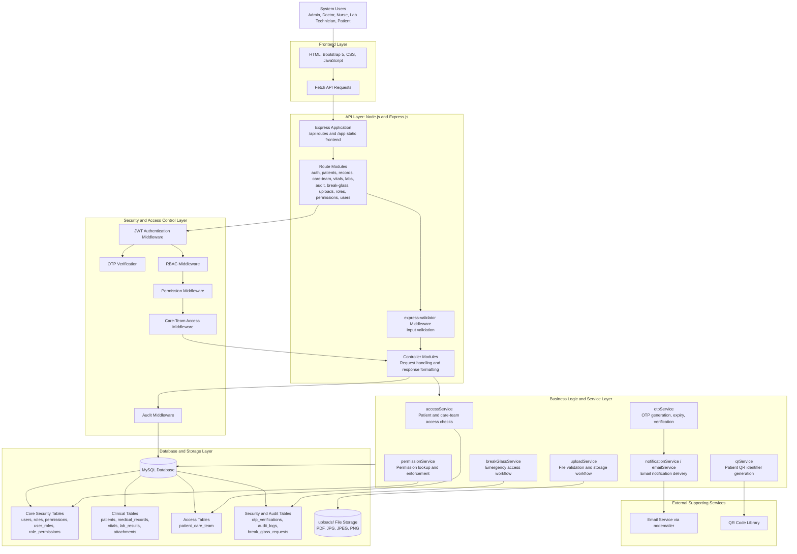

# System Architecture Diagram

**Figure 4.1: System Architecture of the Digital Health Record System Using Role-Based Access Control.**

The architecture shows the implemented multi-layer structure of the system. Users interact with Bootstrap-based frontend pages, which communicate with the Express API through Fetch API requests. Requests are routed through validation, authentication, role-based authorization, permission checks, care-team access enforcement, and audit logging before reaching the controller and service layers. The business services implement core workflows such as OTP verification, access checking, uploads, QR generation, notification delivery, and emergency break-glass access. Persistent records are stored in the MySQL database, while uploaded clinical files are stored in the local uploads directory.
